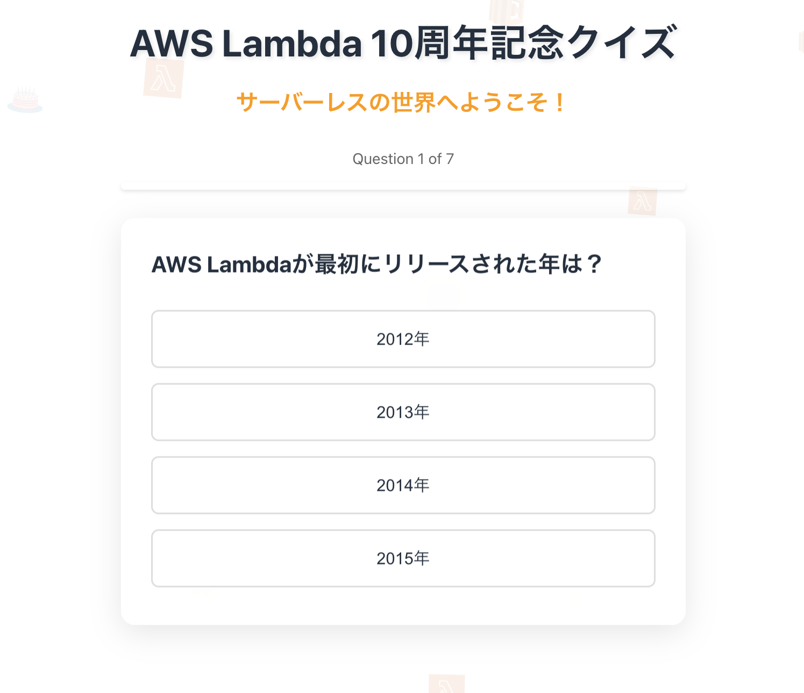

# AWS Lambda 10 周年記念クイズアプリ 🎉

AWS Lambda の 10 周年を祝して作られた、楽しく学べるクイズアプリケーションです。
サーバーレスコンピューティングの歴史と知識をテストしながら、AWS Lambda の 10 年の歩みを振り返ることができます。



## ✨ 特徴

- AWS Lambda に関する 7 つの厳選された問題
- インタラクティブな UI/UX デザイン
- 即座のフィードバックと詳細な解説
- 新旧の Lambda アイコンとバースデーケーキが舞う楽しい背景アニメーション
- レスポンシブデザイン対応
- スコアトラッキングと結果表示

## 🛠 技術スタック

- React 18
- TypeScript
- Vite
- Styled Components
- SVG アニメーション

## 🚀 セットアップ

1. リポジトリのクローン:

```bash
git clone [repository-url]
cd lambda-quiz-app
```

2. 依存関係のインストール:

```bash
npm install
```

3. 開発サーバーの起動:

```bash
npm run dev
```

4. ブラウザで開く:

```
http://localhost:5173
```

## 📦 ビルド

本番用ビルドを作成するには:

```bash
npm run build
```

ビルドされたファイルは `dist` ディレクトリに出力されます。

## 🎮 使い方

1. アプリケーションを開く
2. 質問に対して回答を選択
3. 即座にフィードバックと解説を確認
4. 全 7 問に回答後、総合スコアを確認
5. 「もう一度チャレンジ」ボタンで再挑戦可能

## ✏️ クイズの内容

- AWS Lambda の歴史
- 基本的な制限値と仕様
- サポートされているランタイム
- 料金体系
- パフォーマンスに関する知識
- 実践的なユースケース

## 🎨 デザイン要素

- AWS Lambda の新旧アイコン
- バースデーケーキのアイコン
- AWS カラー（#FF9900）をアクセントとして使用
- モダンでクリーンな UI
- 心地よいアニメーション効果

## 🤝 コントリビューション

1. このリポジトリをフォーク
2. 新しいブランチを作成 (`git checkout -b feature/amazing-feature`)
3. 変更をコミット (`git commit -m 'Add some amazing feature'`)
4. ブランチにプッシュ (`git push origin feature/amazing-feature`)
5. プルリクエストを作成

## 📝 ライセンス

このプロジェクトは MIT ライセンスの下で公開されています。

## 🎉 AWS Lambda 10 周年おめでとう！

2014 年から 2024 年まで、クラウドコンピューティングに革命を起こし続けている AWS Lambda の 10 周年を、
このクイズアプリで一緒にお祝いしましょう！
